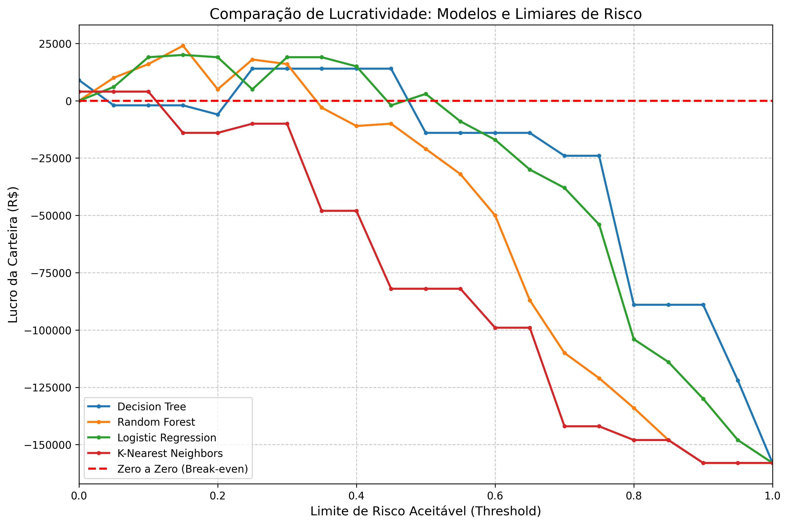

# 🏦 Análise de Risco de Crédito (Credit Scoring) - German Credit Data


## 📄 Descrição do Projeto

Este projeto consiste no desenvolvimento de um modelo de Machine Learning para prever o risco de inadimplência (default) de clientes bancários. O objetivo não é apenas classificar corretamente, mas **maximizar o lucro da instituição financeira** através de uma **Matriz de Custos** personalizada e garantir a transparência das decisões via **SHAP (Explainable AI)**.

O dataset utilizado foi o clássico **Statlog (German Credit Data)**, que contém dados demográficos e histórico financeiro de 1.000 clientes.

---

## 💼 O Problema de Negócio

No cenário de crédito, os erros do modelo têm pesos financeiros diferentes:
* **Erro Tipo I (Falso Positivo):** Negar crédito a um bom pagador. O banco perde os juros (Custo de Oportunidade).
* **Erro Tipo II (Falso Negativo):** Dar crédito a um mau pagador. O banco perde o valor principal emprestado (Prejuízo Real).

**Premissa adotada neste projeto:** O prejuízo de um calote é **5x maior** que o lucro perdido de um bom cliente. O modelo foi otimizado para respeitar essa regra de negócio.

---

## 🛠️ Tecnologias Utilizadas

* **Linguagem:** Python
* **Manipulação de Dados:** Pandas, Numpy
* **Visualização:** Matplotlib, Seaborn
* **Machine Learning:** Scikit-Learn (Random Forest / XGBoost - *ajuste conforme seu modelo*)
* **Explainability:** SHAP (SHapley Additive exPlanations)
* **Balanceamento:** SMOTE (Synthetic Minority Over-sampling Technique)

---

## 📊 Pipeline do Projeto

1.  **Análise Exploratória (EDA):** Identificação de padrões em variáveis como `Duration of Credit`, `Credit Amount` e `Checking Account Status`.
2.  **Pré-processamento:**
    * Codificação de variáveis categóricas (OneHotEncoding/LabelEncoder).
    * Tratamento de dados desbalanceados (70% bons / 30% ruins).
3.  **Modelagem:** Treinamento de algoritmos focados em otimização de *Recall* (para capturar os maus pagadores).
4.  **Avaliação Financeira:** Aplicação da Matriz de Custos para calcular o lucro estimado do modelo versus um cenário sem modelo.
5.  **Explicabilidade:** Uso do SHAP para entender quais features impactam a decisão de crédito.

---

## 📈 Principais Resultados

### 1. Performance dos Modelos

## 📊 Comparativo de Modelos

Como o objetivo do negócio é evitar o calote, a métrica mais importante para nós é o **Recall da Classe 2 (Maus Pagadores)**. Um modelo com alta acurácia que não detecta os caloteiros não serve para o banco.

| Modelo | Acurácia Global | Recall (Maus Pagadores) | F1-Score (Maus Pagadores) | Observação |
| :--- | :---: | :---: | :---: | :--- |
| **Logistic Regression** | 66% | **0.60** 🏆 | 0.50 | Melhor detector de risco |
| **Random Forest** | 73% | 0.51 | **0.52** | Melhor equilíbrio geral |
| Support Vector Machine | **75%** | 0.38 | 0.47 | Alta acurácia, mas deixa passar muitos riscos |
| Decision Tree | 67% | 0.32 | 0.35 | Baixa performance em risco |
| K-Nearest Neighbors | 70% | 0.05 ❌ | 0.08 | Incapaz de detectar caloteiros |

> **Conclusão:** Apesar do SVM ter a maior acurácia (75%), a **Regressão Logística** se mostrou mais viável para o negócio por identificar 60% dos maus pagadores, contra apenas 38% do SVM.


### 2. Impacto Financeiro (Matriz de Custos)
Para demonstrar a aplicabilidade prática dos modelos, simulamos uma operação de crédito real. Em problemas de risco, a métrica técnica (Acurácia) é menos importante do que o **Lucro Líquido**.

#### 1. Premissas da Simulação
Adotamos os seguintes valores para cada cliente da base de teste:
* **Empréstimo Médio:** R$ 5.000,00
* **Lucro (Juros Recebidos):** R$ 2.000,00 (Para bons pagadores aprovados)
* **Prejuízo (Inadimplência):** -R$ 5.000,00 (Para maus pagadores aprovados)

#### 2. Resultados da Simulação

Comparativo do Lucro Líquido gerado por cada modelo versus um cenário base (sem modelo de IA).

| Modelo | Resultado Financeiro | Lucro Extra vs. Sem Modelo | Performance |
| :--- | :--- | :--- | :---: |
| **Logistic Regression** | **R$ 121.000,00** | **+ R$ 112.000,00** | 🏆 **Campeão** |
| Random Forest | R$ 118.000,00 | + R$ 109.000,00 | 🥈 Vice |
| Decision Tree | R$ 112.000,00 | + R$ 103.000,00 | 🥉 3º Lugar |
| *Sem Modelo (Baseline)* | *R$ 9.000,00* | *R$ 0,00* | ⚠️ Risco Alto |
| K-Nearest Neighbors | R$ 1.000,00 | <span style="color:red">- R$ 8.000,00</span> | ❌ Prejuízo |


#### 3. Conclusão de Negócio

* **A Melhor Escolha:** A **Regressão Logística** foi o modelo mais eficiente. Apesar de ter uma acurácia global menor que o SVM ou Random Forest, ela teve o melhor desempenho na detecção de caloteiros (Recall da Classe 2), maximizando o lucro final.
* **O Perigo do KNN:** O modelo KNN apresentou um desempenho financeiro **pior do que não ter modelo nenhum** (R$ 1.000 vs R$ 9.000 do baseline). Isso ocorre porque ele falhou em identificar os perfis de risco, aprovando empréstimos que resultaram em prejuízo massivo.


#### 4. Simulação Financeira
```
--- Simulação Financeira (Decision Tree) ---
Clientes Bons Aprovados: 126 (Lucro: R$ 126000)
Clientes Bons Rejeitados (Custo de Oportunidade): 41 (Perda: R$ 41000)
Calotes Tomados: 28 (Prejuízo: R$ -140000)
=============================================
RESULTADO LÍQUIDO DA CARTEIRA: R$ -55,000.00


--- Simulação Financeira (Random Forest) ---
Clientes Bons Aprovados: 139 (Lucro: R$ 139000)
Clientes Bons Rejeitados (Custo de Oportunidade): 28 (Perda: R$ 28000)
Calotes Tomados: 32 (Prejuízo: R$ -160000)
=============================================
RESULTADO LÍQUIDO DA CARTEIRA: R$ -49,000.00


--- Simulação Financeira (Logistic Regression) ---
Clientes Bons Aprovados: 118 (Lucro: R$ 118000)
Clientes Bons Rejeitados (Custo de Oportunidade): 49 (Perda: R$ 49000)
Calotes Tomados: 23 (Prejuízo: R$ -115000)
=============================================
RESULTADO LÍQUIDO DA CARTEIRA: R$ -46,000.00


--- Simulação Financeira (K-Nearest Neighbors) ---
Clientes Bons Aprovados: 83 (Lucro: R$ 83000)
Clientes Bons Rejeitados (Custo de Oportunidade): 84 (Perda: R$ 84000)
Calotes Tomados: 33 (Prejuízo: R$ -165000)
=============================================
RESULTADO LÍQUIDO DA CARTEIRA: R$ -166,000.00

```

#### 5. Otimização do Limiar de Decisão (Threshold Tuning)Otimização do Limiar de Decisão (Threshold Tuning)

Por padrão, algoritmos de Machine Learning classificam um cliente como "Mau Pagador" se a probabilidade for maior que 50% (0.5). Porém, em nossa análise financeira, descobrimos que **esse padrão gera prejuízo**.

Realizamos uma análise de sensibilidade variando o limiar de decisão de 0 a 100% para encontrar o ponto de lucro máximo ("Sweet Spot").




**Insights do Gráfico:**
1.  **O Perigo do Padrão (0.5):** Se utilizássemos o threshold padrão de 0.5, a carteira entraria em prejuízo (região abaixo da linha vermelha tracejada), pois o modelo seria "leniente" demais.
2.  **O Ponto Ótimo:** O lucro máximo é atingido com um threshold mais rigoroso, entre **0.15 e 0.25**. Isso significa que devemos negar crédito para qualquer cliente com probabilidade de calote acima de ~20%, e não esperar chegar a 50%.
3.  **Robustez:** A Regressão Logística (Linha Laranja) se mostrou mais estável, mantendo a lucratividade positiva por uma faixa maior de limiares do que o Random Forest.

---

## 🚀 Como Executar o Projeto

1. Clone o repositório:
```bash
git clone [https://github.com/SEU_USUARIO/NOME_DO_REPO.git](https://github.com/SEU_USUARIO/NOME_DO_REPO.git)
```

2. Instale as dependências:
```bash
    pip install -r requirements.txt
```


## Autor
[Carlos Franch Aragão]


### O que você precisa fazer agora:

1.  **Preencher os "XX%"** na seção de Resultados com os números reais do seu notebook.
2.  **Salvar as imagens:** Salve o gráfico do SHAP (`summary_plot`) e a Matriz de Confusão como imagens (png) numa pasta e coloque no README (posso te ensinar a linkar a imagem se precisar).
3.  **Requirements:** Lembre-se de gerar o `requirements.txt` (`pip freeze > requirements.txt`).

Ficou do jeito que você queria? Se quiser ajustar o tom para ser mais "técnico" ou mais "executivo", me avise!